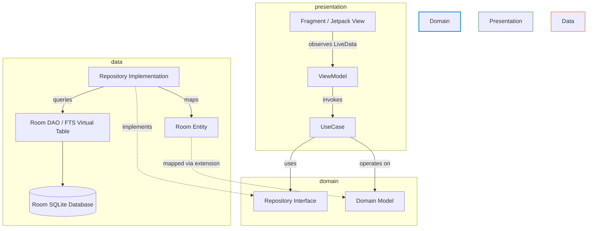

# Architecture Spine — MyFoodTracker

## Design Paradigm

MyFoodTracker enforces a strict **Clean Architecture + MVVM (Model-View-ViewModel)** paradigm. The system is split into three decoupled packages: `presentation`, `domain`, and `data`.



- **`domain/`**: Pure Kotlin business rules. Contains domain models and UseCases. Zero dependencies on Android frameworks (`android.*`), Room, or UI libraries.
- **`data/`**: Data access and infrastructure. Implements Repository interfaces, defines Room Entities, DAOs, and SQLite FTS5 search indexing logic. Maps database entities to domain models via private extensions.
- **`presentation/`**: User interface and state presentation. Houses Fragments, View Binding layout wiring, ViewModels, and Koin state injection.

---

## Invariants & Rules

### AD-1 — Clean Architecture Layer Boundaries [ADOPTED]
- **Binds:** `all` packages
- **Prevents:** Circular dependencies, UI coupling to database schemas, or Android framework leaking into core domain logic.
- **Rule:** The `domain` package MUST NOT import any Android or Room classes. `presentation` MUST only depend on `domain` UseCases and domain models, never directly on `data` repositories or Room Entities.

### AD-2 — Synchronous Room Database Access [ADOPTED]
- **Binds:** `data/` DAOs, Room database builder
- **Prevents:** Race conditions and unnecessary coroutine overhead for instant local DB operations.
- **Rule:** Database queries and ViewModel updates operate synchronously on the main thread using `.allowMainThreadQueries()` in the Room DB builder. Coroutines/`suspend` functions are prohibited for local Room DAO access unless refactoring the underlying builder.

### AD-3 — Domain Model Decoupling & Extensions [ADOPTED]
- **Binds:** `data/repository/`, `domain/model/`
- **Prevents:** Database annotations (`@Entity`, `@ColumnInfo`) or schema changes polluting UI view state and business logic.
- **Rule:** Repositories must map Room Entities to pure Domain Models using private mapper extensions before returning data. Room Entities must never be exposed beyond the `data/` package boundary.

### AD-4 — UseCase Factory Pattern (`operator fun invoke`) [ADOPTED]
- **Binds:** `domain/usecase/`
- **Prevents:** Monolithic service classes and messy invocation syntax.
- **Rule:** Every UseCase MUST be defined as a single-purpose class exposing `operator fun invoke()`. UseCases must be registered in Koin as `factory` bindings.

### AD-5 — Fragment View Binding Lifecycle Safety [ADOPTED]
- **Binds:** `presentation/ui/` Fragments
- **Prevents:** Memory leaks when Fragments outlive their view hierarchies.
- **Rule:** All Fragments utilizing View Binding MUST clear their backing binding field (`_binding = null`) in `onDestroyView()`. `LiveData` MUST always be observed using `viewLifecycleOwner`.

### AD-6 — Centralized Koin DI Registration [ADOPTED]
- **Binds:** `di/AppModule.kt`
- **Prevents:** Scattered dependency declarations making DI tracking difficult.
- **Rule:** All Koin DI declarations MUST reside centrally in `AppModule.kt`: `single` for Data Repositories and Room DB, `factory` for UseCases, and `viewModel` for ViewModels (injected via `by viewModel()`).

### AD-7 — Cascade Deletes & SQLite Foreign Key Constraints [ADOPTED]
- **Binds:** `data/entity/`
- **Prevents:** Orphaned child records in local logs when parent foods/users are deleted.
- **Rule:** Child database entities MUST declare explicit `@ForeignKey` constraints with `onDelete = ForeignKey.CASCADE` and create an index on foreign key columns.

### AD-8 — SQLite FTS5 Search & Autocomplete Engine [ADOPTED]
- **Binds:** `data/dao/FoodFtsDao.kt`, `data/db/AppDatabase.kt`
- **Prevents:** High latency (`> 50ms`) full-table `LIKE` search scans on 50k+ food items.
- **Rule:** Offline food autocomplete MUST use a dedicated SQLite FTS5 virtual table (`foods_fts`) with prefix matching (`query*`) and SQLite database triggers (`AFTER INSERT`, `AFTER DELETE`, `AFTER UPDATE`) to maintain automatic index synchronization.

---

## Consistency Conventions

| Concern | Convention |
| --- | --- |
| **Naming** | Layouts: `activity_*`, `fragment_*`, `item_*`. View IDs: `snake_case` (e.g. `@+id/button_add_water`). ViewModels: `*ViewModel`. UseCases: `*UseCase`. Repositories: `*Repository` (interface), `*RepositoryImpl` (implementation). |
| **Data & Formats** | Primary keys: `TEXT` UUID or `INTEGER` autoincrement. Dates: `YYYY-MM-DD` ISO string. Quantities: `REAL` (grams/milliliters). Macro readouts: `fontFeatureSettings = "tnum"` (tabular figures). |
| **State & Errors** | ViewModel exposes `LiveData<ViewState>`. Data layer exceptions are mapped to domain-specific sealed result classes (`Resource.Success`, `Resource.Error`). |
| **Testing** | Mock repository interfaces for ViewModel/UseCase tests. DAO integration tests run in `androidTest` using `Room.inMemoryDatabaseBuilder()`. |

---

## Stack (Verified & Pinned Seed)

| Technology / Library | Version | Role |
| --- | --- | --- |
| **Android SDK** | Target 36, Min 35 | Target Android runtime platform (Java 11 compatibility) |
| **Android Gradle Plugin (AGP)** | 9.2.1 | Build tool & packaging |
| **Koin** | 3.5.6 | Dependency Injection framework |
| **Room Database** | 2.6.1 (KSP 2.2.10-2.0.2) | SQLite local ORM & persistence engine |
| **Jetpack Navigation** | 2.6.0 | Fragment-based screen navigation & argument passing |
| **Material Components** | 1.10.0 | Material Design 3 UI component system |
| **AppCompat** | 1.6.1 | Android backward compatibility layer |

---

## Structural Seed

```text
c:/Users/Xenae/Documents/source/repos/AndroidStudioProjects/MyFoodTracker/app/src/main/java/sergeevgk/myfoodtracker/
├── data/
│   ├── dao/
│   │   ├── FoodDao.kt              # Room DAO for pre-populated & custom foods
│   │   ├── FoodFtsDao.kt           # SQLite FTS5 virtual table search DAO
│   │   ├── IntakeLogDao.kt         # Meal intake log DAO
│   │   ├── WaterLogDao.kt          # Water log DAO
│   │   └── UserProfileDao.kt       # Profile management DAO
│   ├── db/
│   │   └── AppDatabase.kt          # Room Database definition & pre-seeded asset loader
│   ├── entity/
│   │   ├── FoodEntity.kt           # Room entity for foods
│   │   ├── FoodNutrientEntity.kt   # Base nutrient values per 100g
│   │   ├── IntakeLogEntity.kt      # Meal log entity (FK -> User, Food)
│   │   ├── WaterLogEntity.kt       # Water log entity (FK -> User)
│   │   └── UserProfileEntity.kt    # User profile & goal entity
│   └── repository/
│       ├── FoodRepositoryImpl.kt    # Maps entities to Domain models & executes queries
│       ├── IntakeRepositoryImpl.kt  # Meal logging implementation
│       └── UserRepositoryImpl.kt    # Profile management implementation
├── domain/
│   ├── model/
│   │   ├── FoodItem.kt             # Pure domain food model
│   │   ├── IntakeLog.kt            # Pure domain intake log model
│   │   ├── DailySummary.kt         # Calculated daily macros & water total
│   │   └── UserProfile.kt          # Domain user profile & goal model
│   ├── repository/
│   │   ├── FoodRepository.kt       # Interface contract
│   │   ├── IntakeRepository.kt     # Interface contract
│   │   └── UserRepository.kt       # Interface contract
│   └── usecase/
│       ├── SearchFoodUseCase.kt    # Instant FTS5 prefix search execution
│       ├── LogMealUseCase.kt       # Record food intake with macro calculations
│       ├── LogWaterUseCase.kt      # Quick +250ml water increment
│       ├── ExportLogsUseCase.kt    # Generate CSV/TXT log export
│       └── BackupDatabaseUseCase.kt # Export/Restore SQLite DB file
├── presentation/
│   ├── ui/
│   │   ├── dashboard/              # DashboardFragment & Week-View Slider
│   │   ├── search/                 # FoodSearchBottomSheet & QuantityModal
│   │   ├── customfood/             # CustomFoodEditorFragment
│   │   ├── calendar/               # MonthCalendarFragment
│   │   ├── settings/               # SettingsFragment & Backup/Restore
│   │   └── auth/                   # PasscodeAuthFragment
│   └── viewmodel/
│       ├── DashboardViewModel.kt   # Manages active date, macro rings, water total
│       ├── FoodSearchViewModel.kt  # Manages instant FTS5 autocomplete state
│       └── SettingsViewModel.kt    # Manages backup/restore & CSV export tasks
└── di/
    └── AppModule.kt                # Centralized Koin DI registration
```

---

## Capability → Architecture Map

| Capability / Requirement | Lives in | Governed by |
| --- | --- | --- |
| **FR-1, FR-2: Local User Profiles & Auth** | `presentation/ui/auth/`, `domain/usecase/`, `data/dao/UserProfileDao.kt` | AD-1, AD-5, AD-6 |
| **FR-3, FR-4: Offline Food Search & Autocomplete** | `data/dao/FoodFtsDao.kt`, `domain/usecase/SearchFoodUseCase.kt` | AD-2, AD-3, AD-8 |
| **FR-5, FR-6: Food Intake & Quick-Add Logging** | `data/dao/IntakeLogDao.kt`, `domain/usecase/LogMealUseCase.kt` | AD-2, AD-4, AD-7 |
| **FR-7: Quick Water Log (+250ml)** | `data/dao/WaterLogDao.kt`, `domain/usecase/LogWaterUseCase.kt` | AD-4, AD-6, AD-7 |
| **FR-8, FR-9: Custom Food & Recipe Manager** | `data/dao/FoodDao.kt`, `presentation/ui/customfood/` | AD-1, AD-3, AD-8 |
| **FR-10, FR-11: Dashboard Week Slider & Month Navigation** | `presentation/ui/dashboard/`, `presentation/ui/calendar/` | AD-5, AD-6 |
| **FR-12: CSV / TXT Log Export** | `domain/usecase/ExportLogsUseCase.kt` | AD-1, AD-4 |
| **FR-13: Local DB Backup and Restore** | `domain/usecase/BackupDatabaseUseCase.kt` | AD-2, AD-4 |

---

## Deferred

1. **Self-Hosted Cloud Sync Topology**: Sync protocols (e.g. WebDAV/Nextcloud sync) are deferred to post-MVP (Phase 2).
2. **Camera OCR / On-Device AI Portion Estimator**: On-device ML Kit / TFLite pipeline architecture is deferred to future phases.
3. **Wearable & Health Connect Sync**: Android Health Connect API integration is deferred to post-MVP.
