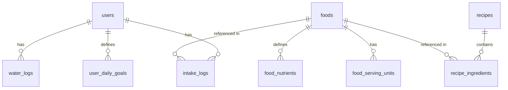

# PRD Addendum: Technical Specifications & DB Design

This addendum captures technical architecture guidelines, database models, and performance engineering details for MyFoodTracker. These choices are informed by [project-context.md](file:///c:/Users/Xenae/Documents/source/repos/AndroidStudioProjects/MyFoodTracker/_bmad-output/project-context.md) conventions.

---

## 1. Database Schema Design (Room & SQLite)

The database will be implemented using Jetpack Room. Because we are following the **Synchronous Execution** rule, queries in the data layer do not use `suspend` modifiers and instead run synchronously on the main thread using `.allowMainThreadQueries()` for database-backed local operations (Room DAOs).



### 1.1 Table Specifications

#### Table: `users`
*   `id`: `TEXT` (UUID) `PRIMARY KEY`
*   `username`: `TEXT`
*   `passcode_hash`: `TEXT`
*   `created_at`: `INTEGER` (Unix timestamp)

#### Table: `foods`
*   `id`: `TEXT` (UUID) `PRIMARY KEY`
*   `name`: `TEXT` (Indexed)
*   `brand`: `TEXT` (Nullable)
*   `barcode`: `TEXT` (Indexed, Nullable)
*   `base_serving_size`: `REAL` (Default `100.0`)
*   `base_serving_unit`: `TEXT` (Default `"g"`)
*   `is_custom`: `INTEGER` (0 = pre-populated, 1 = user created)
*   `is_deleted`: `INTEGER` (Soft delete flag)
*   `created_at`: `INTEGER`
*   `updated_at`: `INTEGER`

#### Table: `food_nutrients`
*   `food_id`: `TEXT` `PRIMARY KEY`, `FOREIGN KEY` references `foods(id)` on delete cascade
*   `calories`: `REAL`
*   `protein_g`: `REAL`
*   `carbs_g`: `REAL`
*   `fat_g`: `REAL`
*   `fiber_g`: `REAL`
*   `sugar_g`: `REAL`
*   `sodium_mg`: `REAL`

#### Table: `food_serving_units`
*   `id`: `INTEGER` `PRIMARY KEY AUTOINCREMENT`
*   `food_id`: `TEXT`, `FOREIGN KEY` references `foods(id)` on delete cascade
*   `unit_name`: `TEXT` (e.g., "slice", "scoop")
*   `grams_per_unit`: `REAL`

#### Table: `intake_logs`
*   `id`: `TEXT` (UUID) `PRIMARY KEY`
*   `profile_id`: `TEXT`, `FOREIGN KEY` references `users(id)` on delete cascade
*   `logged_date`: `TEXT` (Format `"YYYY-MM-DD"`, Indexed)
*   `meal_slot`: `TEXT` (`"BREAKFAST"`, `"LUNCH"`, `"DINNER"`, `"SNACK"`)
*   `food_id`: `TEXT` (Nullable, references `foods(id)`)
*   `custom_name`: `TEXT` (Nullable, for Quick-Add logs)
*   `serving_unit_name`: `TEXT` (e.g. "slice" or "g")
*   `quantity`: `REAL`
*   `calculated_calories`: `REAL`
*   `calculated_protein_g`: `REAL`
*   `calculated_carbs_g`: `REAL`
*   `calculated_fat_g`: `REAL`
*   `logged_at`: `INTEGER`

#### Table: `water_logs`
*   `id`: `TEXT` (UUID) `PRIMARY KEY`
*   `profile_id`: `TEXT`, `FOREIGN KEY` references `users(id)` on delete cascade
*   `logged_date`: `TEXT` (Format `"YYYY-MM-DD"`, Indexed)
*   `amount_ml`: `INTEGER`
*   `logged_at`: `INTEGER`

#### Table: `user_daily_goals`
*   `profile_id`: `TEXT` `PRIMARY KEY`, `FOREIGN KEY` references `users(id)` on delete cascade
*   `target_calories`: `REAL`
*   `target_protein_g`: `REAL`
*   `target_carbs_g`: `REAL`
*   `target_fat_g`: `REAL`
*   `target_water_ml`: `INTEGER`

---

## 2. High-Speed Search Architecture (SQLite FTS5)

To meet the `< 50ms` search latency requirement, we index the food database using the SQLite FTS5 extension. Since Room doesn't build FTS mappings for composite joins natively, we build a dedicated FTS virtual table matching RowIDs from the standard `foods` table.

### 2.1 Virtual Table Definition
```sql
CREATE VIRTUAL TABLE foods_fts USING fts5(
    name,
    brand,
    content='foods',
    content_rowid='id',
    tokenize='unicode61 remove_diacritics 1'
);
```

### 2.2 FTS Auto-Sync Triggers
```sql
-- Insert Trigger
CREATE TRIGGER foods_ai AFTER INSERT ON foods BEGIN
  INSERT INTO foods_fts(rowid, name, brand) VALUES (new.id, new.name, new.brand);
END;

-- Delete Trigger
CREATE TRIGGER foods_ad AFTER DELETE ON foods BEGIN
  INSERT INTO foods_fts(foods_fts, rowid, name, brand) VALUES('delete', old.id, old.name, old.brand);
END;

-- Update Trigger
CREATE TRIGGER foods_au AFTER UPDATE ON foods BEGIN
  INSERT INTO foods_fts(foods_fts, rowid, name, brand) VALUES('delete', old.id, old.name, old.brand);
  INSERT INTO foods_fts(rowid, name, brand) VALUES (new.id, new.name, new.brand);
END;
```

---

## 3. Layer Decoupling & Room Main-Thread Rules

According to the project rules:
1.  **Room Main Thread Queries**: Local DB operations are synchronous and run on the main thread under `.allowMainThreadQueries()`. No `suspend` functions are used.
2.  **Domain Mapping**: In-memory domain models (e.g. `FoodItem`, `DailyIntakeSummary`) are mapped from Room entities in the Repository layer via private extensions.
3.  **UseCase Pattern**: Business logic actions (e.g. `LogMealUseCase`, `SearchFoodUseCase`) are defined with `operator fun invoke()` and injected via Koin DI.
